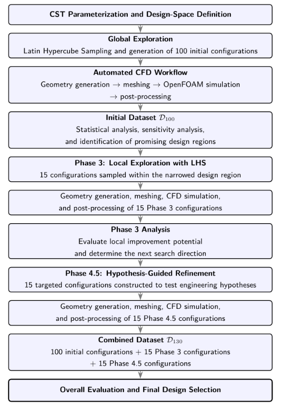
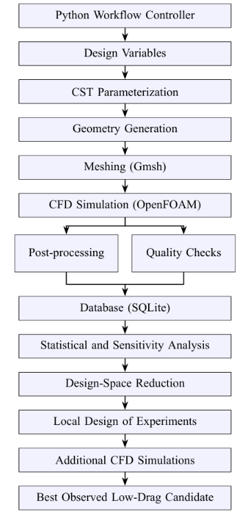

# Methodology

This document summarizes the methodology used to explore and refine the aerodynamic shape of an axisymmetric rocket-shaped UAV body.

The study combines:

- CST geometry parameterization
- design-space sampling
- automated geometry and mesh generation
- OpenFOAM CFD simulations
- database-backed campaign management
- statistical and sensitivity analysis
- local design-space refinement

The primary objective is **relative aerodynamic ranking**: identifying lower-drag geometries under a common CFD setup rather than establishing experimentally validated absolute drag coefficients.

---


## 1. Overall Study Strategy

The investigation was organized as a sequence of global and local design-space searches.



The final curated dataset contains **130 simulated configurations**:


| Stage       | Configurations | Purpose                                    |
| ----------- | -------------- | ------------------------------------------ |
| Initial DOE | 100            | Global exploration of the design space     |
| Phase 3     | 15             | Local exploration around promising regions |
| Phase 4.5   | 15             | Hypothesis-guided targeted refinement      |
| **Total**   | **130**        | Final ranked dataset                       |


The complete dataset is available at:

[View the authoritative 130-case dataset](../data/authoritative_dataset_130.csv)

---


## 2. Geometry Parameterization

The body is modeled as an axisymmetric profile using **Class-Shape Transformation (CST)** parameterization.

Each geometry is defined using five design variables:


| Variable | Meaning                    |
| -------- | -------------------------- |
| λ        | Body slenderness parameter |
| w₀       | CST shape coefficient      |
| w₁       | CST shape coefficient      |
| w₂       | CST shape coefficient      |
| w₃       | CST shape coefficient      |


The maximum body radius is fixed at:

**R_max = 0.070 m**

while the body length varies with the slenderness parameter.

The shape function uses a cubic Bernstein representation, allowing the body profile to be generated from a small number of parameters while maintaining smooth geometry.

The explored range of λ was approximately:

**3.5 ≤ λ ≤ 6.0**

with the CST coefficients sampled on the discrete design grid used by the campaign.

Geometry-generation code is located under:

[Browse the geometry-generation code](../src/geometry/)

The selected final candidate is provided as a lightweight example under:

[View the P45_012 selected case](../examples/selected_case/P45_012/)

---


## 3. Design-Space Sampling

Latin Hypercube Sampling (LHS) was used to distribute candidate configurations throughout the multidimensional design space.

The continuous LHS samples were mapped onto the discrete parameter grid used by the geometry generator. Duplicate parameter combinations were rejected so that each CFD case represented a unique design vector.

The initial campaign was intended to provide broad coverage rather than to immediately locate a mathematical optimum.

After the first 100 CFD cases were evaluated, statistical and sensitivity analyses were used to identify promising regions for additional exploration.

---


## 4. Automated CFD Workflow

The CFD study was designed as an automated pipeline rather than as a collection of manually prepared OpenFOAM cases.



The main workflow is:

```text
Design variables
      ↓
CST parameterization
      ↓
Geometry generation
      ↓
Gmsh mesh generation
      ↓
OpenFOAM simulation
      ↓
Post-processing and quality checks
      ↓
SQLite database
      ↓
Statistical and sensitivity analysis
      ↓
Design-space refinement
```

The major software components are:


| Component          | Role                                                                     |
| ------------------ | ------------------------------------------------------------------------ |
| Python             | Workflow control, geometry generation, campaign management, and analysis |
| Gmsh               | Geometry discretization and mesh generation                              |
| OpenFOAM 13        | CFD solution                                                             |
| SQLite             | Persistent storage of design and simulation results                      |
| Matplotlib / NumPy | Analysis and visualization                                               |


Campaign orchestration is implemented under:

[Browse the campaign-management code](../src/campaign/)

Reporting and analysis tools are located under:

[Browse the reporting and analysis code](../src/reporting/)

---


## 5. CFD Domain

Because the investigated bodies are axisymmetric, a **5° wedge domain** was used instead of a complete three-dimensional body.

This substantially reduces computational cost while retaining the axisymmetric flow behavior required for comparative screening.

The computational domain extends approximately:

- 7.5 body lengths upstream
- 15 body lengths downstream
- 7.5 body lengths in the radial direction

The wedge boundaries represent the rotational symmetry of the complete body.

### Drag-Coefficient Convention

The CFD workflow reports the drag coefficient associated with the 5° wedge configuration.

The same convention is applied consistently to every simulated geometry, making the values suitable for relative ranking.

For conversion to the corresponding full 360° axisymmetric coefficient convention used in the project:

**C_D,360 = 72 × C_D,wedge**

because:

**360° / 5° = 72**

The authoritative CSV should therefore be interpreted using this project-specific coefficient convention rather than compared directly with conventional full-aircraft drag coefficients without applying the appropriate reference convention.

---


## 6. Flow Conditions

The production CFD campaign used a common set of freestream conditions for every body:


| Quantity            | Value                          |
| ------------------- | ------------------------------ |
| Freestream velocity | 138.89 m/s                     |
| Temperature         | 298.15 K                       |
| Pressure            | 101325 Pa                      |
| Density             | approximately 1.184 kg/m³      |
| Dynamic viscosity   | approximately 1.84 × 10⁻⁵ Pa·s |
| Mach number         | approximately 0.40             |


Using the same operating condition for every configuration ensures that differences in the calculated drag coefficient primarily reflect differences in geometry rather than changes in the external flow condition.

---


## 7. Solver Configuration

The production simulations use:

```text
OpenFOAM 13
Steady incompressible RANS
SIMPLE pressure–velocity coupling
k–ω SST turbulence model
```

The production iteration budget is:

**1000 iterations**

A case can terminate either because the configured convergence behavior is satisfied or because the maximum iteration budget is reached.

A simulation that reaches the maximum iteration count is not automatically discarded if a valid drag coefficient has been produced.

For this reason, the final dataset separately records fields such as:

```text
converged_residual
force_converged
termination_reason
```

instead of treating campaign completion as equivalent to mathematical convergence.

---


## 8. Production Mesh

The production mesh configuration is referred to as:

`M4_PRODUCTION`

The mesh uses near-wall prism layers together with refinement of the surrounding fluid domain.

Representative production settings include:

```text
First prism-layer height ≈ 1 × 10⁻⁴ m
Growth ratio             ≈ 1.25
Number of prism layers   = 14
```

The production mesh contains on the order of several hundred thousand cells, with the exact cell count varying slightly with geometry.

Mesh-independence evidence and the limitations associated with the near-wall resolution are discussed separately in:

[Read the numerical verification and validation discussion](validation.md)

---


## 9. Phase 3 — Local Exploration

After analysis of the initial 100-body dataset, the design space was narrowed around regions associated with lower observed drag.

Phase 3 introduced **15 additional configurations** generated using LHS within this reduced region.

The purpose of Phase 3 was not merely to add more samples, but to determine whether local exploration could improve upon the best candidate observed in the initial DOE.

The new cases were processed through the same geometry, meshing, CFD, and post-processing pipeline as the initial campaign.

---


## 10. Phase 4.5 — Hypothesis-Guided Refinement

Phase 4.5 added another **15 targeted configurations**.

Instead of relying only on another broad random sampling stage, these cases were selected to test engineering hypotheses derived from the earlier statistical and geometric analysis.

The purpose was to examine whether specific combinations of CST parameters could further reduce the observed drag coefficient.

This stage produced the final best-observed configuration:

**P45_012**

The geometry and lightweight reproduction inputs for this case are included under:

[View the selected-case example](../examples/selected_case/)

---


## 11. Final Ranking

All three stages were combined into the final dataset:

```text
100 Initial DOE
+ 15 Phase 3
+ 15 Phase 4.5
----------------
= 130 configurations
```

The configurations were ranked by ascending drag coefficient using the same CFD and coefficient convention.

The ranking therefore represents the **best observed designs within the sampled design space**.

It should not be interpreted as proof that the first-ranked design is the mathematical global optimum of the full continuous CST parameter space.

---


## 12. Scope of the Methodology

The workflow is designed primarily for:

- automated aerodynamic screening
- relative design comparison
- identification of promising geometry trends
- reproducible CFD campaign management
- progressive design-space refinement

The methodology does not claim experimental validation of the absolute drag coefficient.

For additional technical details:

- [Numerical Verification and Validation](validation.md) — mesh independence, compressibility sensitivity, convergence, and numerical limitations
- [Results](results.md) — final ranking, design-variable trends, and the selected P45_012 configuration
- [Reproducibility](reproducibility.md) — software requirements and instructions for reproducing the workflow