# Results

This document summarizes the aerodynamic results obtained from the complete CFD design campaign.

The final dataset contains **130 simulated configurations** generated across three stages:

| Stage | Configurations |
|---|---:|
| Initial DOE | 100 |
| Phase 3 local exploration | 15 |
| Phase 4.5 hypothesis-guided refinement | 15 |
| **Total** | **130** |

All configurations were evaluated using the same production CFD methodology and ranked by ascending drag coefficient.

The complete numerical dataset is available at:

`data/authoritative_dataset_130.csv`

The results should primarily be interpreted as **relative aerodynamic comparisons within the common CFD setup**, rather than experimentally validated absolute drag predictions.

---

## 1. Overall Drag Distribution

The 130 simulated configurations produced a broad distribution of drag coefficients.

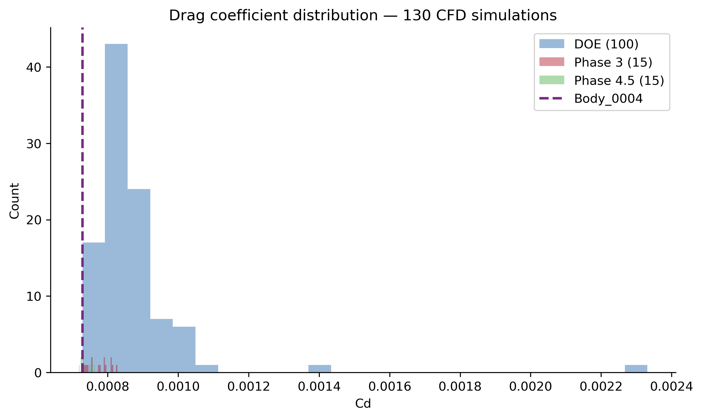

Across the complete dataset:

| Statistic | C_D |
|---|---:|
| Minimum | 0.0007181 |
| 25th percentile | approximately 0.000774 |
| Median | approximately 0.000825 |
| Mean | approximately 0.000846 |
| 75th percentile | approximately 0.000867 |
| Maximum | 0.002332 |

The difference between the best and worst observed configurations is substantial.

The highest observed C_D is more than three times the lowest value, demonstrating that the selected CST parameter ranges generate aerodynamically distinct body shapes.

This spread also indicates that the design-space exploration was not restricted to a very narrow family of nearly identical configurations.

---

## 2. Final Ranking

The final ranking combines all Initial DOE, Phase 3, and Phase 4.5 cases.

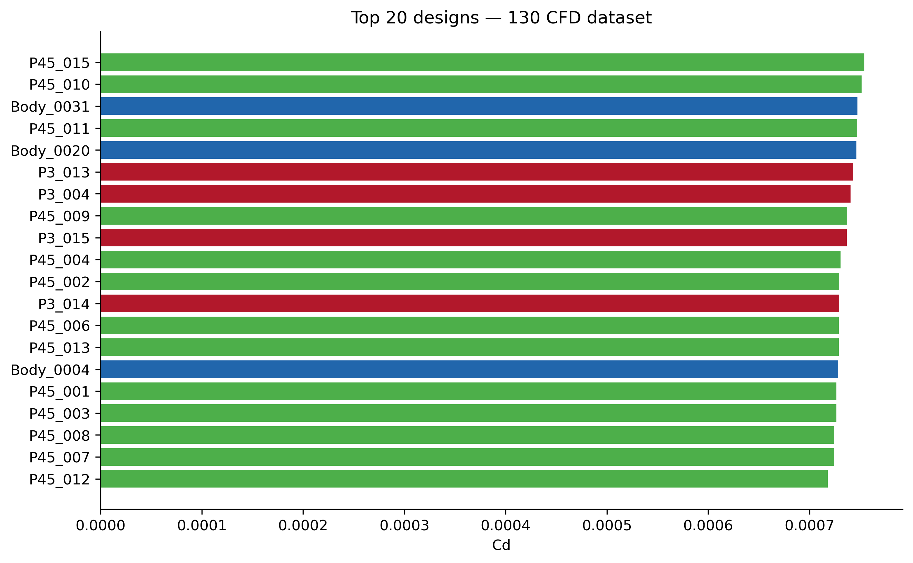

The ten highest-ranked configurations were:

| Rank | Configuration | Stage | C_D |
|---:|---|---|---:|
| 1 | **P45_012** | Phase 4.5 | **0.000718133** |
| 2 | P45_007 | Phase 4.5 | 0.000724363 |
| 3 | P45_008 | Phase 4.5 | 0.000724434 |
| 4 | P45_003 | Phase 4.5 | 0.000725529 |
| 5 | P45_001 | Phase 4.5 | 0.000727290 |
| 6 | Body_0004 | Initial DOE | 0.000728235 |
| 7 | P45_013 | Phase 4.5 | 0.000728554 |
| 8 | P45_006 | Phase 4.5 | 0.000728731 |
| 9 | P3_014 | Phase 3 | 0.000729235 |
| 10 | P45_002 | Phase 4.5 | 0.000729393 |

The final top ten are dominated by Phase 4.5 configurations.

In particular:

- 8 of the final top 10 configurations came from Phase 4.5.
- 13 of the final top 20 configurations came from Phase 4.5.
- the best Initial DOE configuration, Body_0004, moved to rank 6 after the refinement stages.

This indicates that the targeted refinement process successfully concentrated new CFD evaluations in the low-drag region of the sampled design space.

---

## 3. Evolution of the Best Observed Design

The best configuration from the Initial DOE was:

**Body_0004**

with:

**C_D = 0.000728235**

Its design parameters were:

| Parameter | Value |
|---|---:|
| λ | 4.1 |
| w₀ | 0.5 |
| w₁ | 1.4 |
| w₂ | 1.2 |
| w₃ | 0.6 |

Body_0004 remained a strong candidate throughout the study.

Phase 3 included P3_014 with the same geometry parameters as Body_0004. The resulting drag coefficient was very close to the original result, providing an additional indication that this geometry remained within the same low-drag region of the numerical design space.

However, Phase 3 did not produce a new overall best configuration.

The major improvement occurred during Phase 4.5.

The final selected configuration was:

**P45_012**

with:

**C_D = 0.000718133**

This represents an observed reduction of approximately:

**1.39%**

relative to Body_0004 under the same production CFD convention.

The numerical improvement is modest in percentage terms, but it is sufficient to move P45_012 clearly ahead of the original DOE leader within the final ranked dataset.

---

## 4. Best Observed Configuration — P45_012

The final best-observed design has the following CST parameters:

| Parameter | Value |
|---|---:|
| λ | 3.8 |
| w₀ | 0.5 |
| w₁ | 1.5 |
| w₂ | 1.0 |
| w₃ | 0.5 |
| Maximum radius | 0.070 m |
| Body length | 0.532 m |

The resulting body profile is shown below.

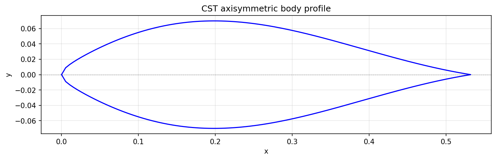

P45_012 should be interpreted as the:

**best observed low-drag configuration among the 130 simulated designs**

rather than as a mathematically proven global optimum of the continuous CST design space.

Lightweight geometry inputs for this configuration are available under:

`examples/selected_case/P45_012/`

---

## 5. Flow Field of P45_012

The velocity field around the selected configuration is shown below.

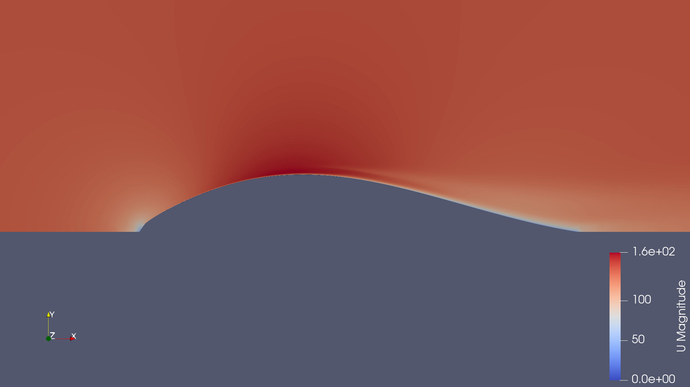

The flow accelerates around the body as the external stream follows the varying surface curvature.

The contour provides a qualitative view of how the selected profile modifies the surrounding velocity field under the production operating condition.

The corresponding pressure field is shown below.

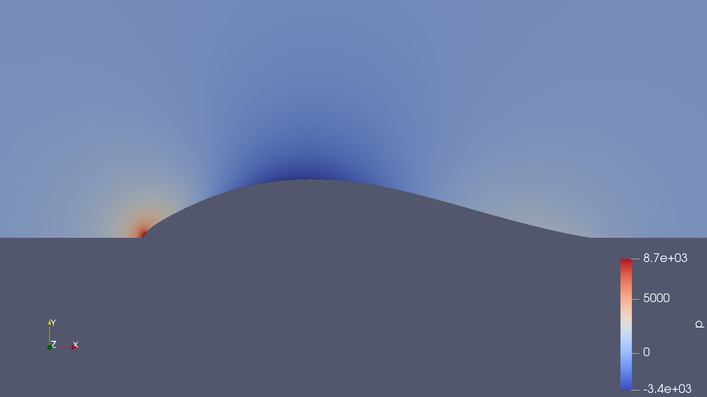

The pressure distribution reflects the interaction between the incoming flow, the nose region, body curvature, and downstream pressure recovery.

These contour visualizations are primarily intended to support physical interpretation of the selected geometry.

The quantitative ranking itself is based on the drag coefficients extracted consistently through the automated CFD workflow.

---

## 6. Relationship Between Slenderness and Drag

The influence of the body slenderness parameter λ is shown below.

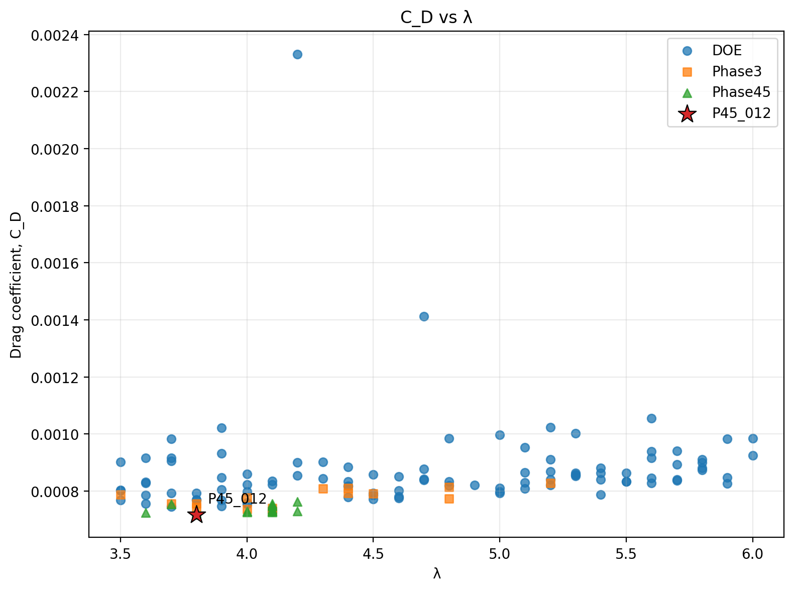

The results do not indicate a simple linear relationship between λ and drag.

Across the complete dataset, the Spearman rank correlation between λ and C_D is approximately:

**ρ = +0.50**

which indicates a moderate positive monotonic tendency over the sampled population.

However, the scatter also shows substantial variation at similar λ values.

This means that body slenderness cannot be considered independently from the CST shape coefficients.

A longer or shorter body is not automatically better: the aerodynamic result depends on the complete distribution of body curvature.

The highest-performing region was concentrated around relatively moderate values of λ rather than at the maximum extent of the sampled range.

---

## 7. Influence of w₀

The relationship between w₀ and drag coefficient is shown below.

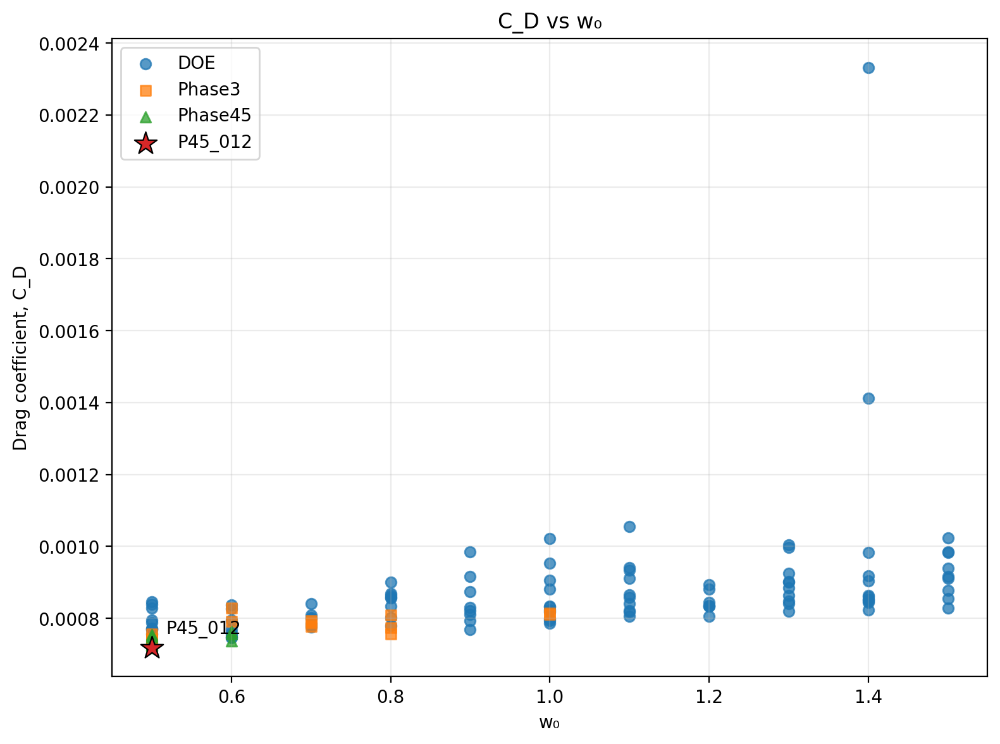

Among the investigated CST coefficients, w₀ exhibits the strongest monotonic association with C_D.

The Spearman correlation is approximately:

**ρ = +0.78**

indicating that increasing w₀ is strongly associated with increasing drag across the sampled dataset.

The best-performing configurations are strongly concentrated toward the lower end of the explored w₀ range.

For example, all five Phase 4.5 configurations occupying ranks 1–5 use:

**w₀ = 0.5**

This result made w₀ one of the most important variables considered during local design-space refinement.

---

## 8. Influence of w₁

The relationship between w₁ and C_D is shown below.

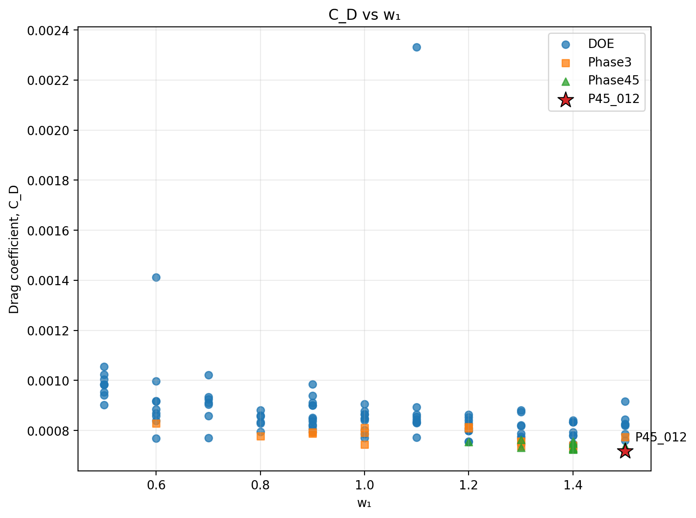

w₁ shows a strong negative monotonic association with drag.

Its Spearman correlation with C_D is approximately:

**ρ = −0.65**

Within the explored design region, larger values of w₁ were generally associated with lower drag coefficients.

This trend is also visible among the highest-ranked designs.

The final best configuration uses:

**w₁ = 1.5**

while several other top-ranked Phase 4.5 configurations use values between approximately 1.4 and 1.5.

The result suggests that the body-shape region controlled by w₁ plays an important role in determining the aerodynamic performance of the parameterized profile.

---

## 9. Influence of w₂

The relationship between w₂ and drag is shown below.

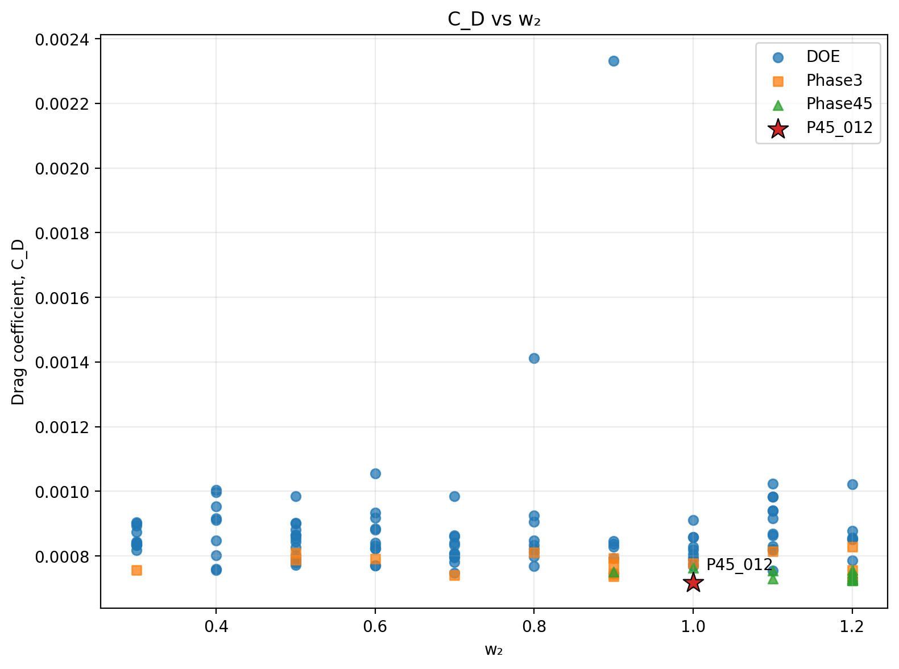

The Spearman correlation between w₂ and C_D is approximately:

**ρ = −0.31**

This association is considerably weaker than those observed for w₀ and w₁.

Although some lower-drag configurations appear within particular w₂ regions, the scatter remains broad.

The result suggests that w₂ influences aerodynamic performance, but its effect cannot be interpreted reliably as a simple one-variable relationship.

Interactions with the other CST coefficients remain important.

---

## 10. Influence of w₃

The relationship between w₃ and drag is shown below.

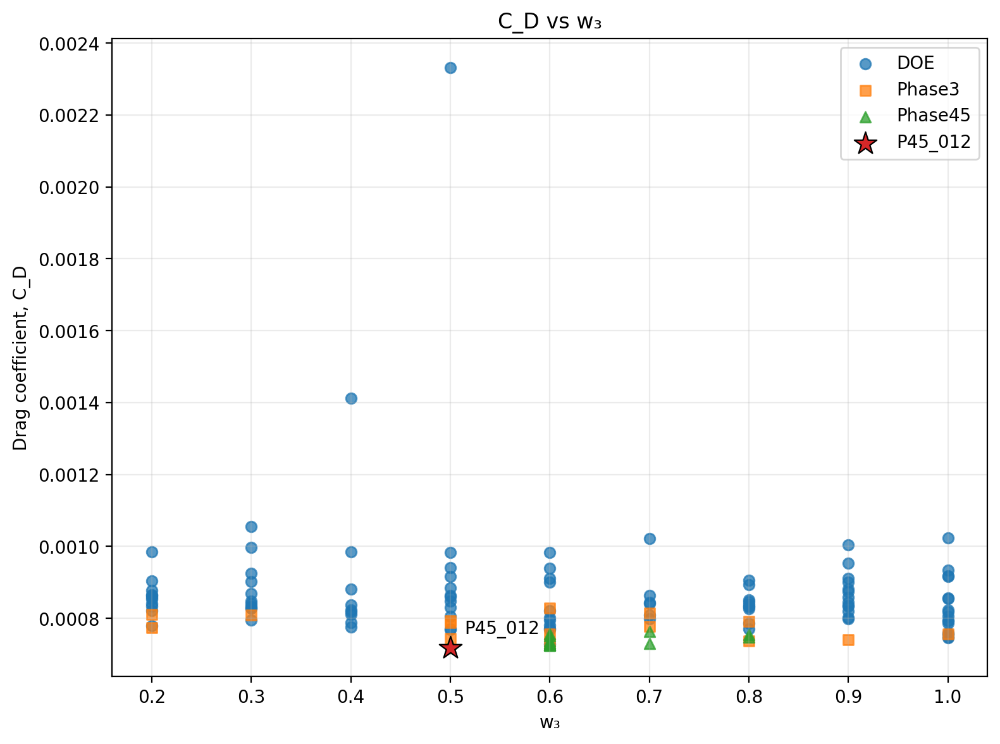

w₃ shows the weakest monotonic relationship with drag among the five design variables.

The Spearman correlation is approximately:

**ρ = −0.14**

The broad scatter indicates that similar w₃ values can correspond to substantially different drag coefficients depending on the remaining geometry parameters.

Therefore, w₃ was not treated as a dominant independent predictor of aerodynamic performance.

This does not mean that w₃ has no physical effect.

Instead, its effect appears comparatively weaker or more strongly coupled with the other CST parameters within the sampled design space.

---

## 11. Spearman Correlation Summary

The overall monotonic relationships between the design variables and C_D are summarized below.

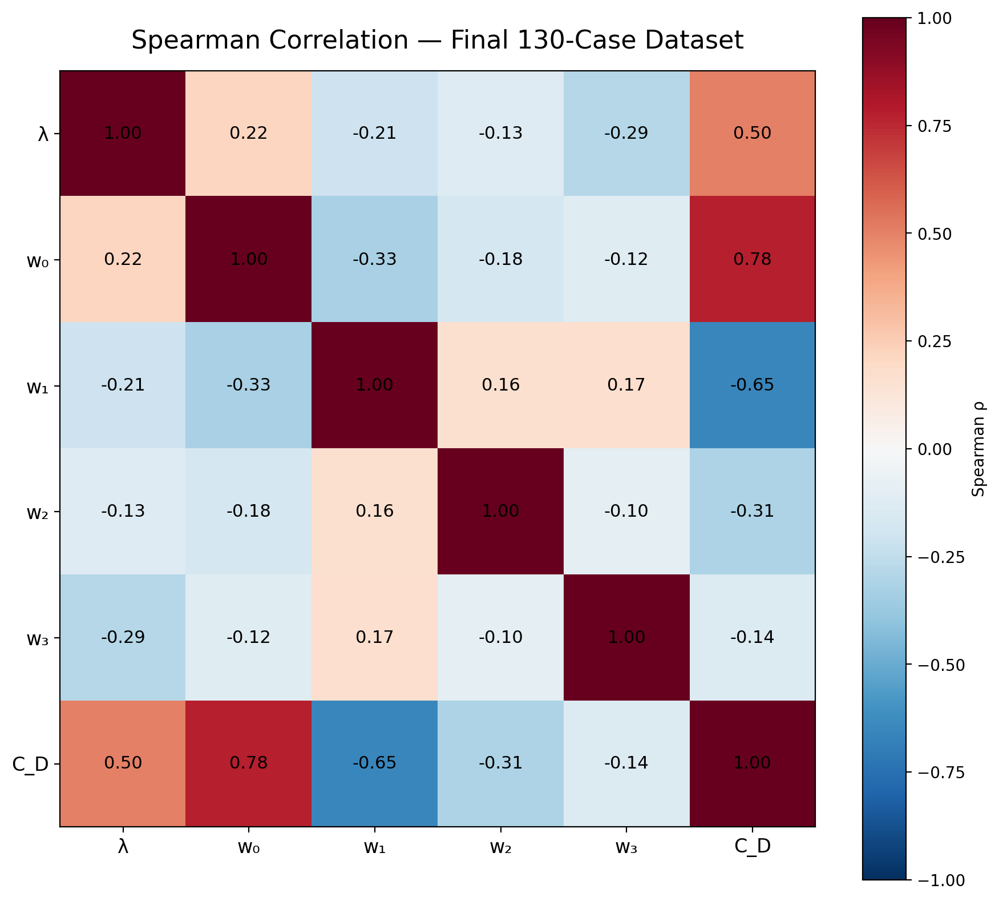

Approximate Spearman correlations with C_D are:

| Variable | Spearman correlation with C_D | Observed tendency |
|---|---:|---|
| w₀ | +0.78 | Strongest positive association |
| w₁ | −0.65 | Strong negative association |
| λ | +0.50 | Moderate positive association |
| w₂ | −0.31 | Weaker negative association |
| w₃ | −0.14 | Weak association |

Based on this analysis, the most influential monotonic tendencies in the sampled dataset are associated with:

**w₀ and w₁**

followed by:

**λ**

while w₂ and especially w₃ show weaker individual monotonic relationships.

These coefficients should not be interpreted as independent causal sensitivities.

The CST parameters jointly define a continuous geometry, so parameter interactions and nonlinear aerodynamic effects remain important.

---

## 12. Why Correlation Alone Was Not Used as an Optimizer

The observed relationships between the CST variables and drag are not sufficiently simple to justify selecting the final geometry directly from correlation coefficients.

For example:

- λ exhibits considerable scatter and nonlinear behavior,
- different CST coefficients interact geometrically,
- similar values of a single parameter can produce different drag coefficients,
- local low-drag regions may not follow a global monotonic trend.

For this reason, the statistical analysis was used primarily to:

- identify influential parameters,
- recognize promising regions,
- generate engineering hypotheses, and
- guide subsequent CFD sampling.

The final design was still selected from **actual CFD simulations**, not from a regression prediction alone.

This was particularly important because surrogate-model performance over the available dataset was not sufficiently strong to replace direct CFD evaluation confidently.

---

## 13. Effect of the Refinement Strategy

The progression from the Initial DOE to Phase 3 and Phase 4.5 demonstrates the difference between broad exploration and targeted refinement.

### Initial DOE

The first 100 configurations explored a large portion of the available discrete CST design space.

This stage identified Body_0004 as the original low-drag leader and provided the dataset required for sensitivity analysis.

### Phase 3

The next 15 configurations focused on the promising region identified from the Initial DOE.

Phase 3 confirmed the quality of this region but did not produce a new overall best configuration.

### Phase 4.5

The final 15 configurations were designed specifically to evaluate targeted hypotheses derived from the earlier analyses.

This stage produced:

- the final ranks 1–5,
- 8 of the top 10 configurations,
- 13 of the top 20 configurations, and
- the final selected design P45_012.

The result demonstrates that the refinement stages were increasingly concentrated in the high-performing region rather than simply adding additional random samples to the original design space.

---

## 14. Convergence Status of the Ranked Results

The final dataset intentionally preserves convergence information for every configuration.

Across all 130 cases:

- 96 satisfied the residual-convergence criterion,
- 14 satisfied the recorded force-convergence criterion,
- 34 reached the configured maximum iteration limit.

The highest-ranked configuration, P45_012, has:

```text
converged_residual = False
force_converged    = False
termination_reason = MAX_ITERATIONS
```

This should not be hidden when interpreting the result.

The simulation produced a valid drag coefficient and was retained by the campaign workflow, but the strict convergence flags were not satisfied before the iteration budget was exhausted.

Therefore, P45_012 is appropriately described as the **best observed candidate from the production campaign**, while further high-fidelity confirmation remains desirable before treating the small difference between closely ranked candidates as definitive.

The distinction between campaign completion and numerical convergence is discussed in more detail in:

`docs/validation.md`

---

## 15. What the Results Support

The combined results support several conclusions within the scope of the present numerical study.

### 1. Geometry has a substantial effect on aerodynamic performance

The 130-body campaign produced a wide range of drag coefficients despite all simulations sharing the same operating and numerical conditions.

### 2. w₀ and w₁ are particularly important design variables

These coefficients show the strongest monotonic relationships with drag within the explored parameter space.

### 3. The best region is defined by combinations of parameters

No single parameter provides a complete explanation of the observed performance.

### 4. Local refinement improved the best observed result

P45_012 reduced the reported drag coefficient by approximately 1.39% relative to the original DOE leader Body_0004.

### 5. Targeted Phase 4.5 sampling was effective

Phase 4.5 configurations dominate the highest-ranked portion of the final dataset.

### 6. The final ranking remains a numerical screening result

Compressibility sensitivity, near-wall resolution, convergence behavior, and the absence of experimental validation limit the interpretation of the absolute C_D values.

---

## 16. Final Selected Candidate

The final selected low-drag candidate is:

**P45_012**

with:

```text
λ  = 3.8
w₀ = 0.5
w₁ = 1.5
w₂ = 1.0
w₃ = 0.5
```

and:

**C_D = 7.18132545 × 10⁻⁴**

under the coefficient convention used throughout the production CFD campaign.

Relative to the original Initial DOE leader Body_0004:

**C_D decreased by approximately 1.39%.**

P45_012 is therefore retained as the **best observed configuration within the 130 simulated cases**.

It is not presented as a mathematically proven global optimum or as an experimentally validated final aerodynamic design.

---

## 17. Recommended Next Step

The natural next step is not another large inexpensive screening campaign.

Instead, the highest-ranked candidates should undergo progressively higher-fidelity confirmation.

A reasonable sequence would be:

```text
Top-ranked production candidates
        ↓
Improved near-wall mesh
        ↓
Compressible CFD
        ↓
Additional convergence confirmation
        ↓
Selected 3D simulations
        ↓
Experimental validation when possible
```

This would help determine whether the relatively small differences among the highest-ranked geometries remain consistent as the numerical fidelity is increased.

---

## Related Documentation

The research strategy and CFD methodology are described in:

`docs/methodology.md`

Numerical verification, compressibility sensitivity, and limitations are discussed in:

`docs/validation.md`

Instructions for reproducing the computational workflow are provided in:

`docs/reproducibility.md`

The complete ranked dataset is available at:

`data/authoritative_dataset_130.csv`

The selected P45_012 geometry is available under:

`examples/selected_case/P45_012/`