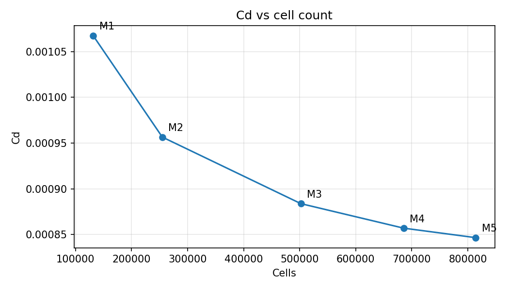
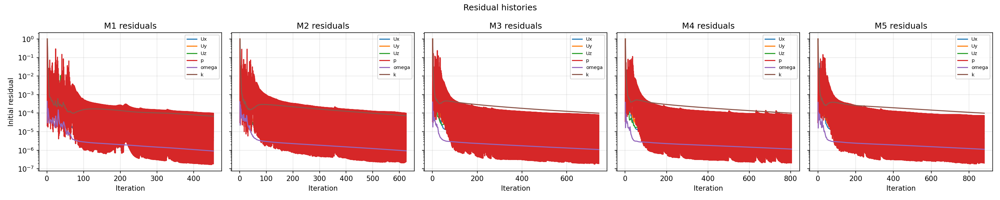
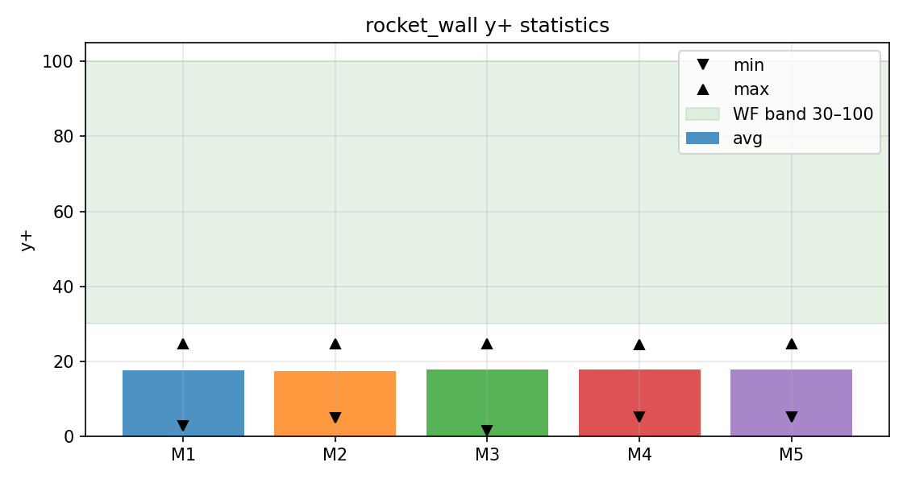
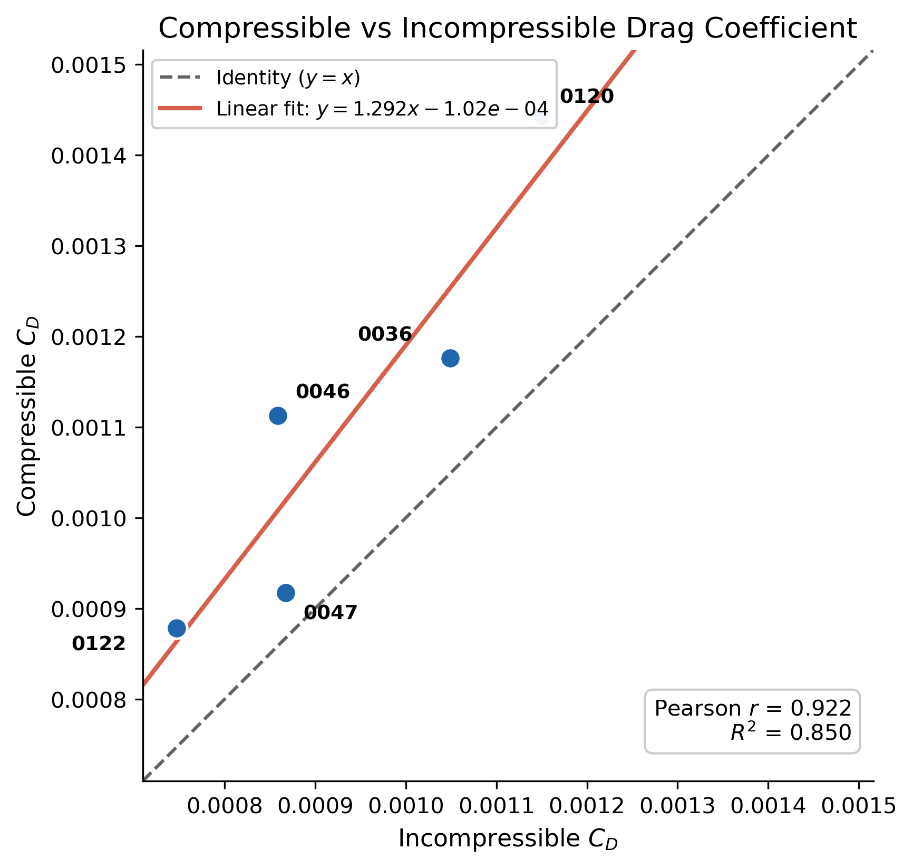
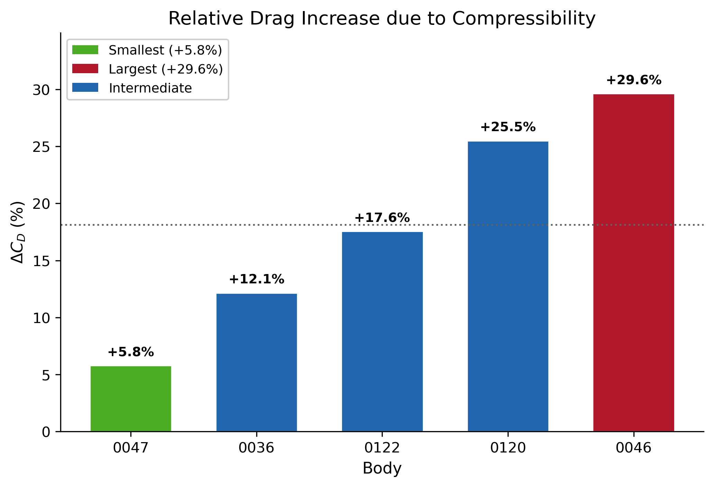
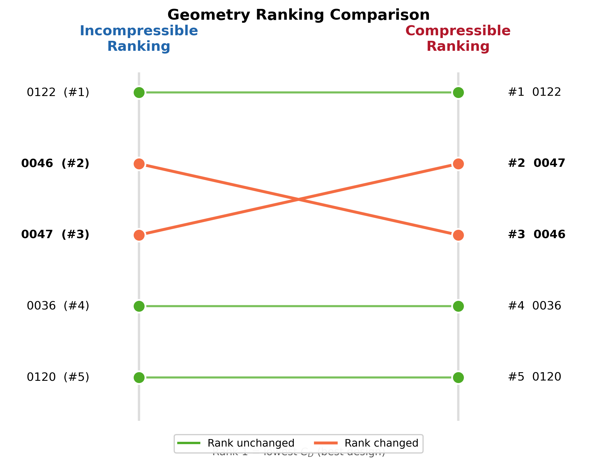

# Numerical Verification and Validation

This document summarizes the numerical checks used to assess the CFD setup before and during the aerodynamic design campaign.

The study was developed primarily for **relative aerodynamic ranking** among geometrically different axisymmetric bodies. The validation strategy therefore focuses on whether the numerical setup is sufficiently consistent for comparative screening.

The principal checks considered were:

- mesh-independence behavior
- solver convergence behavior
- near-wall resolution
- compressibility sensitivity
- turbulence-model sensitivity
- consistency of campaign termination and convergence reporting

No experimental aerodynamic dataset was available for direct validation of the absolute drag coefficient.

---

## 1. Validation Philosophy

The CFD workflow was not intended to establish a high-fidelity absolute drag prediction for a flight-certified vehicle.

Instead, the primary engineering question was:

> Can the numerical workflow distinguish better and worse geometries consistently enough to support automated design-space exploration?

For this reason, the validation process emphasizes:

1. numerical stability,
2. mesh sensitivity,
3. consistency of aerodynamic ranking,
4. identification of model limitations, and
5. transparent reporting of cases that did not satisfy every convergence criterion.

The resulting drag coefficients should therefore be interpreted primarily as **comparative CFD metrics under a common numerical configuration**.

---

## 2. Mesh-Independence Study

A mesh-refinement study was performed using a representative body before selecting the production mesh.

Five mesh levels were examined, progressing from relatively coarse to progressively finer discretizations.

Representative cell counts included approximately:

| Mesh | Approximate cell count |
|---|---:|
| M1 | 132,000 |
| M2 | 255,000 |
| M3 | 502,000 |
| M4 | 685,000 |
| M5 | Finer verification mesh |

The drag coefficient approaches a progressively flatter response as mesh density increases.



The production acceptance criterion was based on the relative change in drag coefficient between successive refined meshes.

The change from **M3 to M4 satisfied the predefined 2% mesh-independence criterion**, so M4 was retained as the production configuration.

The selected production mesh is referred to throughout the repository as:

`M4_PRODUCTION`

The purpose of selecting M4 rather than simply using the finest available mesh was to balance:

- numerical consistency,
- computational cost,
- total campaign size, and
- the need to simulate more than one hundred geometries.

A substantially more expensive mesh would have increased campaign cost without proportionally improving the design-ranking objective.

---

## 3. Solver Behavior During Mesh Refinement

Residual histories were also examined across the mesh-refinement sequence.



The residual plots were used together with force behavior to assess whether the numerical solution had entered a stable regime.

Mesh refinement naturally affects:

- iteration count,
- residual history,
- computational cost, and
- the rate at which aerodynamic forces stabilize.

The mesh study therefore did not rely only on a single residual threshold. The final drag behavior and numerical stability were considered together.

This is particularly important for the production campaign because some geometries produced stable drag estimates without satisfying the strict residual-convergence criterion before the configured iteration limit.

---

## 4. Near-Wall Resolution

The production meshes use prism layers to resolve the boundary-layer region.

Representative settings were:

```text
First prism-layer height ≈ 1 × 10⁻⁴ m
Growth ratio             ≈ 1.25
Number of prism layers   = 14
```

The observed mean y⁺ values for the production configuration were approximately:

**y⁺ ≈ 17–18**

The comparison across mesh levels is shown below.



This value is below the conventional high-y⁺ wall-function range of approximately 30–300.

Therefore, the near-wall treatment should be considered a **known numerical limitation** of the present CFD setup.

The study does not claim that the wall treatment is optimal.

A future higher-fidelity campaign should preferably adopt one of two more consistent strategies:

- a sufficiently fine near-wall mesh targeting y⁺ close to 1, or
- a wall-function mesh designed more deliberately for y⁺ above approximately 30.

For the present study, the same near-wall strategy was applied consistently across the production cases so that relative geometric comparisons remained meaningful.

---

## 5. Compressibility Sensitivity

The production campaign used a steady incompressible solver even though the operating condition was approximately:

**Mach ≈ 0.40**

At this Mach number, compressibility effects are no longer negligible.

A five-body comparison was therefore performed between the production incompressible configuration and a compressible CFD configuration.

The purpose was not to prove that the incompressible solution reproduces the absolute compressible drag coefficient.

Instead, the principal question was whether the **relative aerodynamic behavior and ranking tendency** remained sufficiently similar for design screening.

---

## 6. Incompressible vs Compressible Drag

The comparison showed a strong positive relationship between the drag coefficients predicted by the two formulations.



For the five tested configurations, the linear correlation was approximately:

**Pearson r ≈ 0.92**

This indicates strong overall agreement in the direction of aerodynamic variation across the selected geometries.

However, the compressible solutions did not reproduce the same absolute drag values.

The difference between the two formulations varied significantly among the tested bodies.



The observed increases in drag coefficient for the compressible calculations were approximately within the range:

**+6% to +30%**

depending on geometry.

This confirms that incompressibility is a meaningful source of uncertainty in the absolute CFD result at Mach 0.40.

---

## 7. Ranking Sensitivity to Compressibility

Because the central purpose of the campaign was geometry ranking, the ordering of the five validation bodies was examined directly.



Most of the ranking structure was preserved.

The principal local difference was a neighboring rank exchange between:

```text
Body_0046
Body_0047
```

while the other tested configurations retained their relative positions.

The result therefore supports the following interpretation:

- the incompressible formulation captures the broad ranking tendency,
- local rank changes can occur between closely performing designs,
- the incompressible model should not be treated as an exact substitute for compressible CFD.

For large-scale design screening, the lower computational cost of the incompressible formulation was considered acceptable.

For final high-fidelity aerodynamic prediction, compressible CFD would be preferable.

---

## 8. Why the Incompressible Solver Was Retained

The complete design study required more than one hundred CFD simulations.

Using the production incompressible formulation provided a practical compromise between:

- computational cost,
- campaign duration,
- automation robustness, and
- relative design discrimination.

The five-body compressibility study showed sufficiently strong overall agreement to justify continuing the broad screening campaign with the incompressible solver.

This decision should be understood as a **design-screening assumption**, not as evidence that compressibility effects are negligible.

The final aerodynamic coefficients remain subject to compressibility-related bias.

---

## 9. Turbulence-Model Sensitivity

The production turbulence model was:

**k–ω SST**

A sensitivity comparison with the Spalart–Allmaras model was performed during development of the CFD methodology.

The comparison showed that the turbulence-model choice materially affected the predicted drag coefficient.

k–ω SST was therefore retained as the common production model for the design campaign.

The purpose of this comparison was not to identify a universally superior turbulence model, but to avoid mixing turbulence formulations within the ranked dataset.

Every production configuration was evaluated using the same turbulence-model definition so that the ranking remained internally consistent.

The sensitivity to turbulence modeling remains another source of uncertainty in the absolute aerodynamic prediction.

---

## 10. Convergence Criteria

The production simulations used a maximum budget of:

**1000 iterations**

Convergence monitoring considered both residual behavior and aerodynamic-force behavior.

Two concepts are deliberately kept separate in the dataset:

### Residual convergence

Recorded by:

`converged_residual`

This indicates whether the solver satisfied the configured residual-convergence requirement.

### Force convergence

Recorded by:

`force_converged`

This indicates whether the aerodynamic-force history satisfied the force-stability criterion used by the campaign analysis.

The stopping mechanism itself is recorded using:

`termination_reason`

Typical values include:

```text
RESIDUAL_CONVERGED
MAX_ITERATIONS
SOLVER_CRASH
```

This separation is important because a CFD case can generate a usable and stable drag estimate even when the strict residual threshold is not reached before the iteration budget.

---

## 11. Campaign Completion Is Not the Same as Numerical Convergence

Within the campaign-management system, a body may be marked as successfully completed when:

- the solver terminates without a fatal numerical error,
- a valid drag coefficient is produced, and
- the resulting data are successfully persisted.

Therefore:

**COMPLETED does not necessarily mean residual-converged.**

For example, several highly ranked configurations in the final dataset reached:

`MAX_ITERATIONS`

while still producing valid aerodynamic coefficients.

This behavior is intentionally retained in:

`data/authoritative_dataset_130.csv`

through the fields:

```text
converged_residual
force_converged
termination_reason
```

rather than silently labeling every completed simulation as converged.

---

## 12. Interpretation of the Mesh and Solver Verification

The mesh and convergence studies support use of the selected configuration for **relative comparison within the campaign**.

They do not establish exact discretization independence of every individual geometry.

The production dataset spans bodies with different:

- lengths,
- surface curvatures,
- pressure gradients, and
- boundary-layer behavior.

Consequently, local mesh quality and near-wall behavior may vary slightly between configurations even when the same mesh-generation strategy is used.

The mesh study should therefore be interpreted as verification of the **production meshing methodology**, rather than proof that every case has zero discretization error.

---

## 13. Main Numerical Limitations

The principal numerical limitations of the present study are:

### 1. Near-wall resolution

Mean production y⁺ values of approximately 17–18 fall below the conventional high-y⁺ wall-function range.

### 2. Compressibility

The production solver is incompressible at approximately Mach 0.40.

The validation comparison shows that compressibility can alter the absolute drag coefficient and can cause local rank changes.

### 3. Steady RANS assumption

The production workflow uses steady RANS and therefore does not resolve potentially unsteady turbulent structures directly.

### 4. Turbulence-model dependence

The predicted drag coefficient is sensitive to the selected turbulence model.

### 5. Finite iteration budget

Some bodies reach the 1000-iteration limit without satisfying the strict residual criterion.

### 6. Axisymmetric wedge assumption

The 5° wedge representation assumes axisymmetric flow and cannot capture fully three-dimensional effects associated with a complete UAV configuration.

---

## 14. Experimental Validation Status

No wind-tunnel or flight-test drag measurements were available for direct comparison with the CFD predictions.

Therefore, this repository does **not** claim experimental validation of the absolute drag coefficient.

The validation presented here is primarily:

- numerical verification,
- model-sensitivity assessment, and
- consistency checking for comparative aerodynamic ranking.

This distinction is important.

The results support statements such as:

> P45_012 produced the lowest observed drag coefficient among the 130 configurations evaluated under the common CFD setup.

They do not support a statement such as:

> P45_012 has been experimentally proven to have this exact drag coefficient.

---

## 15. Appropriate Use of the Results

The present CFD results are most appropriate for:

- ranking geometrically related candidate bodies,
- identifying aerodynamic trends,
- screening promising regions of the CST design space,
- guiding subsequent higher-fidelity simulations, and
- demonstrating an automated CFD optimization workflow.

They should be used more cautiously for:

- absolute force prediction,
- direct comparison with unrelated aircraft drag coefficients,
- flight-performance prediction, or
- final engineering certification.

---

## 16. Recommended Future Validation

A future development of the project should include:

1. compressible production CFD for the highest-ranked candidates,
2. improved near-wall mesh design,
3. a controlled y⁺ target near 1 or within a deliberate wall-function regime,
4. additional mesh-independence checks on geometrically different bodies,
5. transient simulations for selected configurations,
6. comparison with experimental force measurements if test facilities become available, and
7. full three-dimensional CFD when vehicle components are incorporated.

These additions would allow the workflow to progress from comparative design screening toward higher-confidence aerodynamic prediction.

---

## Related Documentation

The overall research methodology is described in:

`docs/methodology.md`

The final 130-case aerodynamic results are discussed in:

`docs/results.md`

Instructions for reproducing the computational workflow are provided in:

`docs/reproducibility.md`

The authoritative ranked dataset is available at:

`data/authoritative_dataset_130.csv`